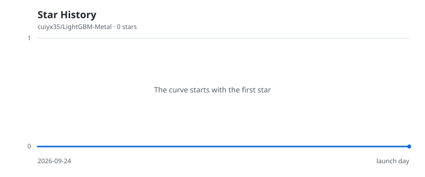

# LightGBM Metal: an Apple Silicon experiment

[简体中文](README.md) · **English**

> [!IMPORTANT]
> This is an independent experimental fork based on LightGBM 4.7.0, not an official LightGBM release. The Metal backend has been performance-tested on one Apple M5 only. Validate model quality on your own data before practical use.

This project adds <code>device_type="metal"</code> on Apple Silicon. During training, the GPU calculates histograms for eligible feature groups while the CPU calculates histograms for the remaining groups. The CPU also performs split search and grows trees. Prediction and model saving use the standard LightGBM paths. Training **combines CPU and GPU work**; it is not a GPU-only backend.

## Current capabilities and limits

- The Metal path handles feature groups with one feature, no multi-value representation, and at most 256 bins. Other groups run on the CPU.
- GPU histogram sums use fixed-point quantization. Close split decisions can produce different trees and predictions from CPU training. Small prediction differences or similar metrics on synthetic data do not establish application model quality.
- Building requires Apple Silicon macOS, a Metal-capable GPU, CMake, a C++ toolchain, and a working OpenMP runtime. Python validation scripts also require NumPy, pandas, and scikit-learn.
- Performance has not been checked on other M-series chips. Speed depends on data distribution, chip, CPU thread count, thermals, and background load.

See the [experimental user notes](docs/Metal-Experimental.en.md) for architecture, limits, and options. Contributors should read the [development guide](docs/Metal-Development.en.md).

## Build and quick validation

Run these commands from the repository root, configuring OpenMP for your toolchain:

~~~bash
cmake -S . -B build-metal -DCMAKE_BUILD_TYPE=Release -DUSE_METAL=ON
cmake --build build-metal -j2
ln -sfn ../lib_lightgbm.dylib python-package/lib_lightgbm.dylib
export PYTHONPATH="$PWD/python-package"
python examples/python-guide/metal_validate.py --output metal_validation.json
python examples/python-guide/metal_synthetic_benchmark.py --output metal_quick_benchmark.json
~~~

Verify that Python imports <code>lightgbm</code> and the Metal-enabled <code>lib_lightgbm.dylib</code> from this checkout. The validator uses generated data for five model-level cases, writes JSON, and exits nonzero on failure. The benchmark defaults to a small smoke test. Set <code>device_type="metal"</code> to train with Metal, or <code>device_type="cpu"</code> for the CPU path.

## Public benchmark

On one Apple M5 with 32 GiB unified memory, a generated-data test with 3.3 million fit rows, 0.8 million held rows, 512 features, 500 trees, and 6 CPU threads produced a **1.55× CPU/Metal median training-time ratio**. The median ratio for training plus prediction was 1.53×. Including the one-time data generation and Dataset construction cost shared by both backends gives an estimated overall ratio of 1.45×. There were two runs per backend; these numbers do not describe other machines or real application data. See the [public benchmark report](benchmarks/metal/README.en.md) for configuration, raw JSON, model differences, and limitations.

The full-scale synthetic test needs substantial unified memory and must be selected explicitly:

~~~bash
python examples/python-guide/metal_synthetic_benchmark.py \
  --full-scale --output synthetic_metal_result.json
~~~

The script generates data locally and reads no external data file. Public reports contain no row-level predictions.

## Star History

<picture>
  <source media="(prefers-color-scheme: dark)" srcset="assets/star-history-dark.svg" />
  
</picture>

[A workflow in this repository](.github/workflows/star-history.yml) refreshes the chart weekly from GitHub data using its short-lived repository token. No personal token is sent to a third-party chart service. A new repository shows a zero line until its first star.

## Documentation and extension

| Topic | 中文 | English |
| --- | --- | --- |
| Project entry | [README.md](README.md) | This page |
| Metal usage and validation | [实验使用说明](docs/Metal-Experimental.md) | [Experimental Metal notes](docs/Metal-Experimental.en.md) |
| Architecture and extension workflow | [开发指南](docs/Metal-Development.md) | [Development guide](docs/Metal-Development.en.md) |
| Benchmarks and limitations | [公开基准报告](benchmarks/metal/README.md) | [Benchmark report](benchmarks/metal/README.en.md) |
| Coding-agent guidance | [AGENTS.md](AGENTS.md) | [AGENTS.en.md](AGENTS.en.md) |

The table covers documentation specific to this experimental fork; generic upstream LightGBM docs remain in their original language.

The validation and benchmark scripts provide CLI arguments, exit codes, and JSON output for CI and AI-assisted development. Backend changes should preserve upstream behavior with <code>USE_METAL=OFF</code>, and test model structure, predictions, performance, and fallbacks on generated data.

## Provenance and license

This repository starts from a source snapshot of [official LightGBM 4.7.0 commit <code>8f7036f</code>](https://github.com/lightgbm-org/LightGBM/commit/8f7036f03627054d5a54a6f965b13f4b9ff2cb63). Earlier history remains in the [official LightGBM repository](https://github.com/lightgbm-org/LightGBM). The fork retains the upstream [MIT license](LICENSE) and third-party license notices. Use the [official documentation](https://lightgbm.readthedocs.io/) for generic LightGBM functionality and installation guidance.
