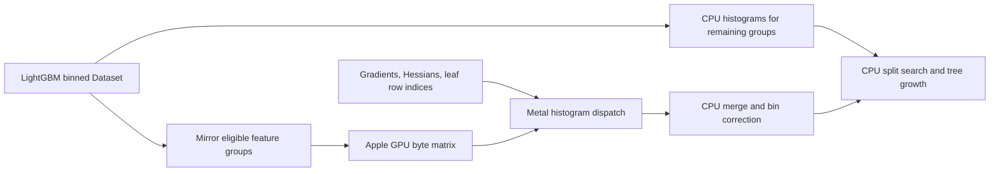

# Developing the experimental Metal backend

[简体中文](Metal-Development.md) · **English** · [Project home](../README.en.md)

This guide is for human and AI contributors working on this fork. It is based
on LightGBM 4.7.0 at upstream commit `8f7036f`. The fork adds
`device_type="metal"` behind the `USE_METAL` CMake option. It is a research
backend; only Apple M5 has been measured so far.

## How training is divided



`MetalTreeLearner` extends the serial tree learner. `BuildMirror()` selects
groups containing one feature, not marked multi-value, with no more than 256
bins. It stores each group's bin for each training row in a dense byte matrix
on shared memory. Other groups stay on CPU. `ConstructHistograms()` starts a
Metal command for selected groups, builds the remaining histograms on CPU,
then waits for Metal and writes its results into LightGBM's histogram arrays.
The CPU owns split search, tree growth, model serialization, and prediction.

The GPU kernel is compiled from the `kMetalSource` string at runtime. Each
threadgroup handles one feature group and one shard of selected rows. It sums
quantized gradient and Hessian values into 32-bit threadgroup atomics in
bounded chunks, stores 64-bit shard totals, then the CPU converts and merges
them to double precision. Default values are 256 rows per chunk, 32,768 rows
per shard, and 64 threads per group. Quantization and floating-point merge
order can change close split decisions; CPU and Metal models are not promised
to be byte-identical.

| File | Responsibility |
| --- | --- |
| `CMakeLists.txt` | Opt-in Metal build and Apple framework linkage |
| `include/LightGBM/config.h`, `src/io/config.cpp` | Accept `device_type=metal` |
| `src/treelearner/tree_learner.cpp` | Select `MetalTreeLearner` |
| `src/treelearner/metal_tree_learner.h` | Learner interface and fallback flags |
| `src/treelearner/metal_tree_learner.mm` | Eligibility, data mirror, GPU kernel, CPU/GPU overlap, merge, profiling |
| `examples/python-guide/metal_validate.py` | Five synthetic model-level checks |
| `examples/python-guide/metal_synthetic_benchmark.py` | Reproducible CPU/Metal timing and synthetic quality report |

## Safe extension sequence

1. Identify the target feature-group representation and its bin layout in
   LightGBM. Choose CPU or GPU for the **entire group** so the CPU result
   cannot overwrite GPU bins.
2. Update the mirror and kernel together. Check group bin offsets, default
   and most-frequent bins, missing values, and per-group output boundaries.
3. Keep the 32-bit chunk accumulation bound valid for the chosen scale.
   Check histogram conservation and the final bin correction before using
   the new group type for split search.
4. Run synthetic validation and compare the serial diagnostic path with the
   overlapping path. Examine model trees and held predictions, not just a
   short training-time number.
5. Benchmark at the intended row, feature, and tree scale on an idle machine.
   Record the chip, threads, warmups, run order, data construction time,
   training time, prediction time, peak memory, and relevant model metrics.

Small prediction differences can compound across hundreds of trees. A
synthetic test with nearly identical CPU and Metal predictions is an
engineering check, not application quality approval. Report meaningful
model-level differences even when an aggregate metric improves.

## Local build and script entry points

Follow [the experimental user notes](Metal-Experimental.en.md) for prerequisites.
On a Mac with CMake and OpenMP configured:

```bash
bash tools/build-metal-macos.sh --validate
PYTHONPATH="$PWD/python-package" python3 examples/python-guide/metal_synthetic_benchmark.py \
  --output metal_quick_benchmark.json
```

Make sure Python loads `lightgbm` and `lib_lightgbm.dylib` from this checkout;
another installed LightGBM package may hide this backend. The synthetic
benchmark defaults to a quick run. Its 4.1-million-row preset requires
`--full-scale` and substantial unified memory. Both scripts provide `--help`,
exit nonzero on failure, and write JSON; `status` is the first field to check.
The benchmark report includes `configuration`, `run_order`, `runs`, `median`,
speed ratios, prediction differences, and limitations. The validator report
includes five `cases`. These are experimental report formats; when changing
their keys, update examples and documentation together.

## Diagnostic controls

| Environment variable | Purpose |
| --- | --- |
| `LGBM_METAL_PROFILE=1` | Log learner training, split search, GPU inflight/wait, CPU histogram, data mirror, setup, merge, and dispatch totals |
| `LGBM_METAL_DISABLE_OVERLAP=1` | Run Metal and CPU histogram work serially for a comparison |
| `LGBM_METAL_FORCE_CPU=1` | Use CPU histograms through the Metal learner for diagnosis |
| `LGBM_METAL_COMPARE_HIST=1` | Compare one GPU histogram with a CPU calculation |
| `LGBM_METAL_VERIFY_QUANTIZED_GROUP=all` | Recompute GPU integer bins on CPU for a selected dispatch |
| `LGBM_METAL_VERIFY_QUANTIZED_DISPATCH=N` | Choose which dispatch to verify with the previous option |
| `LGBM_METAL_THREADS_PER_GROUP=64\|128\|256` | Test kernel threadgroup sizes |
| `LGBM_METAL_ROWS_PER_SHARD=...` | Test 4,096 to 65,536 rows per shard (supported choices are in source) |
| `LGBM_METAL_ROWS_PER_CHUNK=32\|64\|128\|256` | Test quantized accumulation chunk sizes |
| `LGBM_METAL_COMPACT_GROUPS=0` | Restore the older noncompact GPU grid for A/B comparison |
| `LGBM_METAL_MIN_LEAF_ROWS=N` | Experiment with CPU fallback below a leaf row threshold |

These flags can change results and timing. The public benchmark rejects
diagnostic overrides so its headline speed ratio uses the normal path. For
profiling, run a separate diagnostic job and label it as such.
`train` measures training inside the tree learner, excluding Python data generation,
Dataset construction, and prediction. `gpu_inflight` is wall time from command
submission until the CPU observes completion, including queueing and execution.
`gpu_execution` sums GPU execution times reported by Metal command buffers;
`gpu_timing_samples` counts valid timestamps. `gpu_wait` is CPU time waiting for
GPU completion. GPU and CPU histogram work can overlap, so do not sum these
cumulative stage totals into an end-to-end duration. Profiling
and logging can also affect performance, so use interleaved runs with profiling
disabled for speed comparisons.

## Publishing and portability

This branch is an independent fork, not an official LightGBM release.
The benchmark results in [`benchmarks/metal`](../benchmarks/metal/README.en.md)
come from one Apple M5 and generated data. A different M-series chip,
OpenMP setup, feature distribution, or tree depth can change the balance
between CPU and GPU. Keep real application data and identifiers out of the
fork. Preserve the upstream MIT license and submodule notices.
